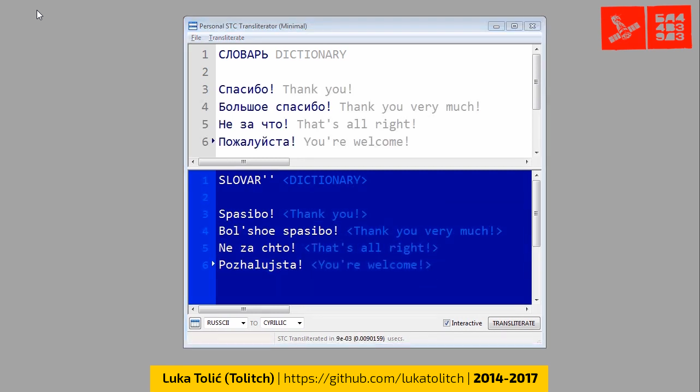
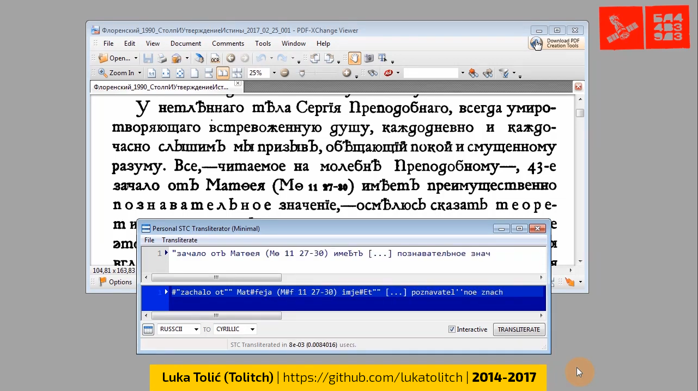

# Personal Scintilla-Based Transliterator

(Note that this project was abandoned long ago, with the last build on my Windows machine in 2017. There's a new version, developed in C#, that will have its own GitHub repository soon.)

You can see the transliterator in action on YouTube: https://www.youtube.com/watch?v=Kry-ZyZy8fs

This is an old personal application from 2015 (first edit in 2014, last in 2017), written in Python 2.7, using the wxPython 3.0 (https://wxpython.org/) library to create the graphical user interface (GUI), and the Cython compiler (http://cython.org/) to speed-up the main transliteration functions.

My main motivation was to improve the great Russian-language online application for entering Cyrillic text with the Latin keyboard “Translit” (http://translit.net/) with a series of additional options that I needed in my daily work (learning the Russian language). I added to the capabilities of “Translit” the:

[1] ability to combine transliterated and non-transliterated text during input (i.e. Cyrillic and Latin in the same text), which is not possible in “Translit”;

[2] using an extended list of Cyrillic characters, which allows entering, for example, characters from the old Russian spelling, which is also not currently possible in “Translit”;

[3] freely defining new transliteration rules through external CSV tables, while in “Translit” currently only a few predefined standard simplified tables can be used;

[4] using Unicode combining characters to mark accents, which is not currently possible in “Translit”;

[5] in addition to the rules of transliteration between letters, it is possible to define special abbreviations for characters from the Unicode repertoire, useful for morphological and phonological annotation, which is not currently available in “Translit”.

Algorithm: based on an external CSV or XML transliteration table, an internal table is formed with a number of manipulation methods. The original text is first divided into segments for transliteration and segments that should be left un-transliterated using a regular expression. For the selected source and target transliteration systems, a pair map and compiled regular expression for recognition are generated from the internal table. The transliteration function in the source text recognizes and transliterates or ignores segments of the source text, and adds them to the list that is converted into concatenated target text at the end of the process. All transliteration functions are written in “Cython”, which uses a language amalgam of Python and C to generate more efficient Python C-code.

Transliteration speed is quite good for Python, and acceptable for interactive use, about 100 characters in 2e-04 (0.0002), 1000 characters in 2e-03 (0.002), and 10000 characters in 2e-02 (0.02) user seconds on my computer at that time (PC, Intel Core i3, 4 GB RAM, 3 GHz).

For longer texts, it is possible to use the non-interactive mode of transliteration, or the transliteration of an external text file.

The key GUI element used is the “Scintilla” text editor (http://www.scintilla.org/), usually used to edit, display and work with the code of various programming languages, while in this application two such editors are synchronized, one (active) for entering and editing Latin text and special abbreviations, and the other (passive) for displaying the final transliterated or substituted text.

To run the transliterator app you'll need:

[1] Python 2.7: https://www.python.org/download/releases/2.7/

[2] wxPython 3.0 (32 Bit): https://sourceforge.net/projects/wxpython/files/wxPython/3.0.2.0/

[3] Cython (see below): https://pypi.python.org/pypi/Cython/

[4] PyDispatcher: https://pypi.python.org/pypi/PyDispatcher

[5] DateUtil: https://pypi.python.org/pypi/python-dateutil

To make Cython and the 'pyximport' command to work on Windows, do the following (source: https://github.com/cython/cython/wiki/CythonExtensionsOnWindows):

[1] After Cython has been installed, you need to install also the Microsoft Visual C++ for Python 2.7.

[2] Then, in file "C:\Python27\Lib\distutils\msvc9compiler.py" change the following:

	def find_vcvarsall(version):\
		"""Find the vcvarsall.bat file\

		At first it tries to find the productdir of VS 2008 in the registry. If\
		that fails it falls back to the VS90COMNTOOLS env var.\
		"""\
		vsbase = VS_BASE % version

with:

	def find_vcvarsall(version):\
		"""Find the vcvarsall.bat file\

		At first it tries to find the productdir of VS 2008 in the registry. If\
		that fails it falls back to the VS90COMNTOOLS env var.\
		"""\
		vsbase = VS_BASE % version\
		vcpath = os.environ['ProgramFiles']\
		vcpath = os.path.join(vcpath, 'Common Files', 'Microsoft',\
			'Visual C++ for Python', '9.0', 'vcvarsall.bat')\
		if os.path.isfile(vcpath): return vcpath\
		vcpath = os.path.join(os.environ['LOCALAPPDATA'], 'Programs', 'Common', 'Microsoft', 'Visual C++ for Python', '9.0', 'vcvarsall.bat')\
		if os.path.isfile(vcpath): return vcpath\

[3] In the same folder make a new file, "distutils.cfg", in which write the following:

	[build]\
	compiler=msvc
